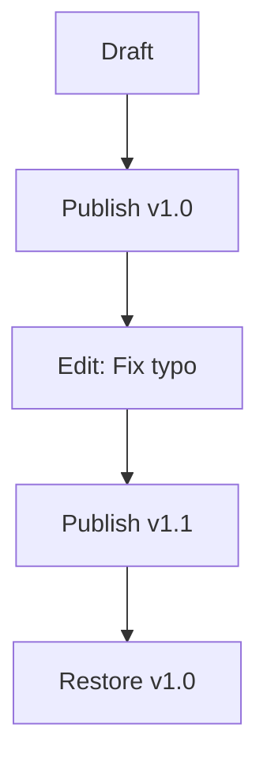

## Overview

Mark Marchenko provides a comprehensive suite of tools for creating, managing, and sharing project documentation. You streamline your workflows with intuitive editing, robust version control, team collaboration, powerful search, and flexible exports. These features ensure your docs stay organized, accessible, and up-to-date.

<Columns cols={3}>
  <Card title="Page Creation & Editing" icon="edit-3" href="#creating-and-editing">
    Build rich MDX pages with real-time previews.
  </Card>
  <Card title="Version Control" icon="git-branch" href="#version-control">
    Track changes with full history and diffs.
  </Card>
  <Card title="Team Collaboration" icon="users" href="#collaboration">
    Work together seamlessly with comments and approvals.
  </Card>
  <Card title="Search & Filters" icon="search" href="#search">
    Find content quickly across your docs.
  </Card>
  <Card title="Export Options" icon="download" href="#exports">
    Generate PDFs, Markdown, or HTML exports.
  </Card>
</Columns>

## Creating and Editing Documentation Pages

You create new pages directly from the dashboard or sidebar. The WYSIWYG editor supports Markdown, MDX components, and embeds, with live previews to see changes instantly.

<Steps>
  <Step title="Create a New Page" icon="plus">
    Navigate to your workspace and click **New Page**. Choose a template or start blank.
  </Step>
  <Step title="Edit Content" icon="edit">
    Use the editor toolbar for headings, lists, and components. Add code blocks with syntax highlighting.
  </Step>
  <Step title="Preview and Publish" icon="eye">
    Toggle the preview pane. Click **Publish** to make it live.
  </Step>
</Steps>

<Callout kind="tip">
  Enable auto-save to prevent data loss during long editing sessions.
</Callout>

## Version Control and History Tracking

Mark Marchenko tracks every change automatically. You view full history, compare versions, and restore previous states with a click.

Access history via the page menu (**...** > **View History**). Diffs highlight additions (`+`), deletions (`-`), and modifications.



## Collaboration Tools for Teams

Invite team members to collaborate in real-time. Features include inline comments, @mentions, and approval workflows.

<Tabs>
  <Tab title="Comments" icon="message-circle">
    Add comments to specific text or sections. Resolve threads as you address feedback.
  </Tab>
  <Tab title="Real-time Editing" icon="edit-3">
    Multiple users edit simultaneously with cursor indicators and conflict resolution.
  </Tab>
  <Tab title="Permissions" icon="shield">
    Set roles: Viewer, Editor, Admin. Control who can publish or export.
  </Tab>
</Tabs>

## Search and Filtering Functionalities

Search across all pages with full-text indexing. Filters refine results by tags, date, or author.

| Filter Type | Description | Example |
|-------------|-------------|---------|
| Tags | Match labeled content | `api`, `v2.0` |
| Date Range | Recent changes | Last 7 days |
| Author | Specific contributor | `@john.doe` |
| Type | Pages, snippets, comments | Pages only |

Use advanced operators like `"exact phrase"` or `AND/OR`.

<Callout kind="info">
  Keyboard shortcut: <kbd>Ctrl</kbd>+<kbd>K</kbd> opens global search instantly.
</Callout>

## Export Options for Documents

Export pages or entire workspaces in multiple formats. Customize with themes or watermarks.

<CodeGroup tabs="Markdown,PDF,HTML">
  ```bash
  # CLI export example
  mark export --page=my-docs --format=md --output=./exports/
  ```
  ```bash
  # PDF with custom theme
  mark export --page=my-docs --format=pdf --theme=dark
  ```
  ```bash
  # Full workspace HTML
  mark export --workspace=project --format=html --zip=true
  ```
</CodeGroup>

<Expandable title="Advanced Export Configuration" default-open="false">
  Create a `{config.json}` file for batch exports:

  ```json
  {
    "pages": ["docs/*"],
    "format": "pdf",
    "options": {
      "includeComments": true,
      "pageNumbers": true
    }
  }
  ```

  Run: `mark export --config=config.json`
</Expandable>