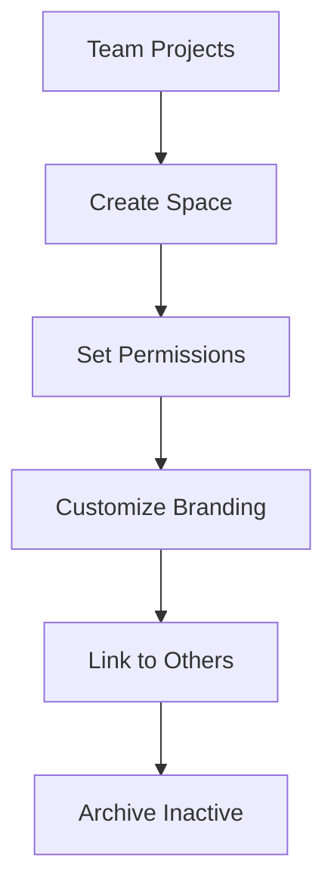

## Overview

Mark Marchenko lets you create dedicated documentation spaces for different projects or teams. Each space acts as an isolated environment where you organize pages, set permissions, and apply custom branding. Use spaces to separate public docs from internal wikis or client-specific guides.

<Columns cols={3}>
  <Card title="Create Spaces" icon="plus" href="#creating-spaces">
    Set up new spaces in seconds with role-based access.
  </Card>
  <Card title="Customize Branding" icon="palette" href="#customizing">
    Match your brand with colors, logos, and layouts.
  </Card>
  <Card title="Organize Efficiently" icon="folder" href="#best-practices">
    Follow tips to keep spaces scalable and searchable.
  </Card>
</Columns>

## Creating New Spaces and Setting Permissions

Start by navigating to the Spaces dashboard in your Mark Marchenko account. Click the "New Space" button to begin.

<Steps>
  <Step title="Access Dashboard" icon="layout">
    Log in to `https://dashboard.example.com/spaces`.
  </Step>
  <Step title="Create Space" icon="plus">
    Enter a name like "Project Alpha Docs" and select visibility: public, private, or team-only.
  </Step>
  <Step title="Set Permissions" icon="shield">
    Assign roles: Admin (full access), Editor (write), Viewer (read-only).
  </Step>
  <Step title="Save and Invite" icon="users">
    Generate invite links or add users by email.
  </Step>
</Steps>

<Callout kind="tip">
  Use group permissions for teams. Link Active Directory or LDAP for enterprise setups.
</Callout>

For API-based creation, use this endpoint:

<CodeGroup tabs="JavaScript,cURL">
  ```javascript
  const response = await fetch('https://api.example.com/v1/spaces', {
    method: 'POST',
    headers: { 'Authorization': `Bearer ${YOUR_API_KEY}`, 'Content-Type': 'application/json' },
    body: JSON.stringify({
      name: 'Project Beta Docs',
      permissions: { roles: ['admin', 'editor'] }
    })
  });
  ```
  ```bash
  curl -X POST https://api.example.com/v1/spaces \
    -H "Authorization: Bearer YOUR_API_KEY" \
    -H "Content-Type: application/json" \
    -d '{"name": "Project Beta Docs", "permissions": {"roles": ["admin", "editor"]}}'
  ```
</CodeGroup>

<ParamField path="name" param-type="string" required="true">
  Unique space name, max 50 characters.
</ParamField>

<ParamField body="permissions.roles[]" param-type="array" required="false">
  Array of roles: `["admin"]`, `["editor", "viewer"]`.
</ParamField>

## Customizing Space Layouts and Branding

Tailor each space to fit your needs. Update layouts via the Space Settings panel.

<Tabs>
  <Tab title="Layout" icon="layout">
    Choose from sidebar navigation, full-width pages, or custom headers.

    ```json
    {
      "layout": "sidebar",
      "navigation": "collapsible",
      "theme": "light"
    }
    ```
  </Tab>
  <Tab title="Branding" icon="palette">
    Upload logos and set colors. Use your brand color like `#3B82F6`.

    <Image
      src="https://example.com/branding-preview.png"
      alt="Space branding customization preview"
      width="600"
      height="300"
    />
  </Tab>
</Tabs>

## Archiving and Deleting Spaces

Archive inactive spaces to preserve history without cluttering your dashboard. Deleting is permanent—export content first.

<Callout kind="alert">
  Back up pages before deletion. Archived spaces count toward quotas but hide from searches.
</Callout>

<Steps>
  <Step title="Archive Space">
    Go to Space Settings > Lifecycle > Archive.
  </Step>
  <Step title="Delete Space">
    Select Delete after confirming export.
  </Step>
</Steps>

## Linking Spaces Across Projects

Connect spaces for cross-referencing. Use deep links or embed pages.

```javascript
// Embed space page in another
const embedUrl = 'https://docs.example.com/spaces/project-alpha/page/intro';
```

<Expandable title="Advanced Linking via API" default-open="false">
  Create links programmatically:

  <CodeGroup tabs="Python,JavaScript">
    ```python
    import requests
    response = requests.post('https://api.example.com/v1/spaces/project-alpha/links', 
                            headers={'Authorization': 'Bearer YOUR_API_KEY'},
                            json={'target': 'project-beta/intro'})
    ```
    ```javascript
    await fetch('https://api.example.com/v1/spaces/project-alpha/links', {
      method: 'POST',
      headers: { 'Authorization': `Bearer ${YOUR_API_KEY}` },
      body: JSON.stringify({ target: 'project-beta/intro' })
    });
    ```
  </CodeGroup>
</Expandable>

## Best Practices for Space Organization

- Limit spaces to 10 per team to avoid fragmentation.
- Use consistent naming: `{project}-{team}-{year}` like `alpha-engineering-2024`.
- Set homepage redirects for quick access.
- Review permissions quarterly.



Follow these to maintain scalable documentation.